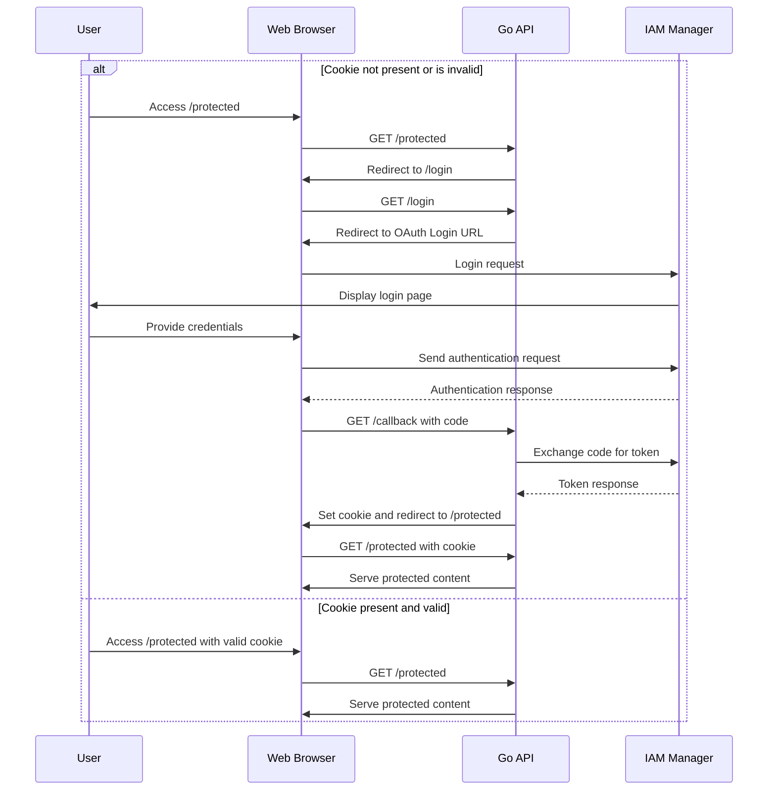

# oauth2-example (WIP)

This is a simple example of protecting REST endpoints using an identity manager and OpenID as authentication protocol. As identity manager, I use [Keycloak](https://www.keycloak.org)

## **Enjoy!!!!**

## How to run it

### 1. Start the `keycloak` container in its own terminal

```sh
    make run-oauth2
```

### 2. Open a new terminal session and run following steps.

1. Create the realm, the client and the user

```sh
    make create-realm
```

2. Run the API

```sh
    make run-api
```

### 3. Open the browser and go to [protected endpoin](http://localhost:9000/protected)

When you do it, you'll be redirected to the log in page of the identy manager. Then log in and you'll be redirected to protected endpoint with a valid authentication JWT token.

User credentials to log in:

- user: jarus
- password: jarus

**That's it !!! :-D**

# What authentication middleware does

The `http.AuthMiddleware` function in the provided code is a middleware function in Go that is used to check if a user is authenticated before allowing them to access certain routes or resources. Let's break down how it works:

1. The `AuthMiddleware` function takes in a slice of `*rsa.PublicKey` as a parameter. This is used to verify and parse the JSON Web Tokens (JWT) received from the user.

2. Inside the `AuthMiddleware` function, it returns another function of type `echo.MiddlewareFunc`. This inner function is the actual middleware that will be executed for each request.

3. The inner middleware function takes in a `next` handler function of type `echo.HandlerFunc` and returns another `echo.HandlerFunc`. This allows the middleware to wrap around the subsequent handler functions in the request chain.

4. Within the inner middleware function, it first checks if the current request path is either "/login" or "/callback". If it is, it skips the authentication check and proceeds to the next handler by calling `next(c)`.

5. If the request path is not "/login" or "/callback", it proceeds to check for the authentication token in the request cookie. It uses the `c.Cookie(authCookieName)` function to retrieve the cookie with the name "my-auth-cookie".

6. If there is an error retrieving the cookie or if the token value is empty, it logs an error and redirects the user to the "/login" page using `c.Redirect(http.StatusTemporaryRedirect, "/login")`.

7. If the token is successfully retrieved from the cookie, it then calls the `parseJWT` function (which is not shown in the provided code) to parse and validate the token using the provided `rsaPublicKey`. If there is an error parsing the token, it logs an error and redirects the user to the "/login" page.

8. If the token is successfully parsed, it extracts the roles from the token and sets them in the request context using `c.Set("roles", roles)`.

9. Finally, it calls the `next(c)` function to proceed to the next handler in the request chain.

In summary, the `AuthMiddleware` function is a middleware that checks if a user is authenticated by verifying the JWT token stored in a cookie. It ensures that only authenticated users with valid tokens and the required roles can access protected routes or resources.

# Auth diagram



## Used stack

- Go 1.22.3
- Keycloack 24.0.1
- Docker 25.0.3
- Google Chrome as browser
