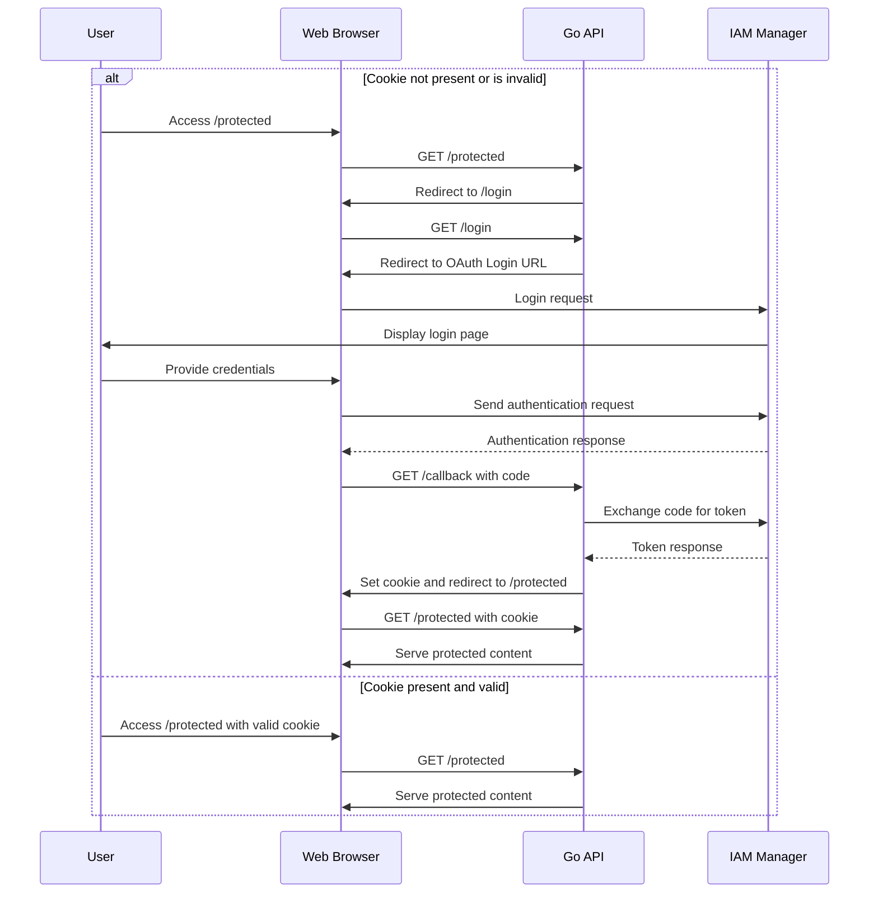

# Auth diagram

```mermaid
sequenceDiagram
    participant User
    participant WebBrowser as Web Browser
    participant API as Go API
    participant IAM as IAM Manager

    alt Cookie not present or is invalid
        User->>WebBrowser: Access /protected
        WebBrowser->>API: GET /protected
        API->>WebBrowser: Redirect to /login
        WebBrowser->>API: GET /login
        API->>WebBrowser: Redirect to OAuth Login URL
        WebBrowser->>IAM: Login request
        IAM->>User: Display login page
        User->>WebBrowser: Provide credentials
        WebBrowser->>IAM: Send authentication request
        IAM-->>WebBrowser: Authentication response
        WebBrowser->>API: GET /callback with code
        API->>IAM: Exchange code for token
        IAM-->>API: Token response
        API->>WebBrowser: Set cookie and redirect to /protected
        WebBrowser->>API: GET /protected with cookie
        API->>WebBrowser: Serve protected content
    else Cookie present and valid
        User->>WebBrowser: Access /protected with valid cookie
        WebBrowser->>API: GET /protected
        API->>WebBrowser: Serve protected content
    end
```
